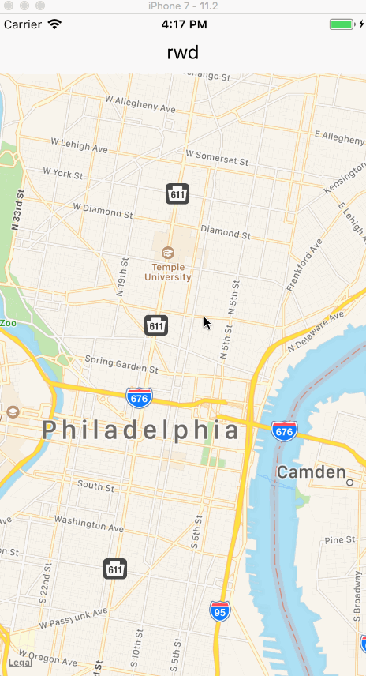

# react-native-rwd

[](https://travis-ci.org/azavea/react-native-rwd)

A research project to build a mapping application with React Native.



## Requirements

- Node 8.x or greater
- [Expo CLI](https://github.com/expo/exp)
- [Rake](https://github.com/ruby/rake)

## Setup

To build a development environment for the project, run:

```sh
rake
```

You'll also need to set the following environment variables:

```sh
export RWD_API_KEY=foo
export RWD_API_URL=bar
```

## Development Server

```sh
rake server
```

## Run on iOS Simulator

```sh
rake ios
```

## Testing

```sh
rake lint
```
